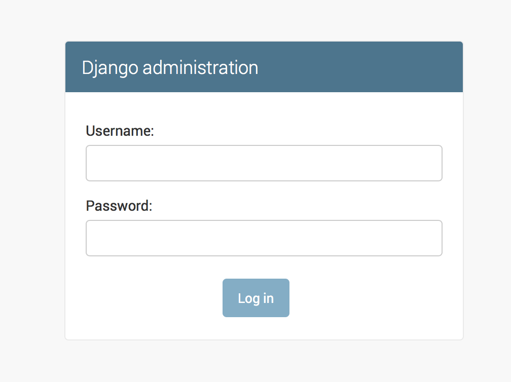
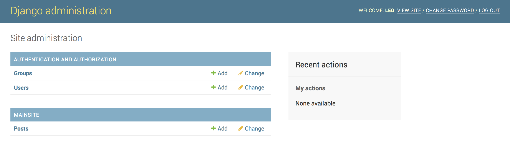
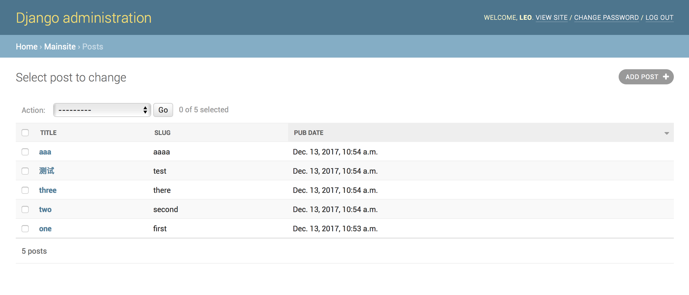

# pd-blog

My blog developed by Python Django

## Preparation

```
$ pip install virtualenv

$ virtualenv virtual
$ cd virtual
$ source bin/activate
$ pip install django
```

## Create the web framework

```
(virtual) ➜  django-admin startproject mblog
(virtual) ➜  cd mblog
(virtual) ➜  python manage.py startapp mainsite

(virtual) ➜  tree .
.
├── mainsite
│   ├── __init__.py
│   ├── admin.py
│   ├── apps.py
│   ├── migrations
│   │   └── __init__.py
│   ├── models.py
│   ├── tests.py
│   └── views.py
├── manage.py
└── mblog
    ├── __init__.py
    ├── __pycache__
    │   ├── __init__.cpython-36.pyc
    │   └── settings.cpython-36.pyc
    ├── settings.py
    ├── urls.py
    └── wsgi.py

4 directories, 14 files
```

## Run the server

```
(virtual) ➜  python manage.py runserver

Performing system checks...

System check identified no issues (0 silenced).

You have 14 unapplied migration(s). Your project may not work properly until you apply the migrations for app(s): admin, auth, contenttypes, sessions.
Run 'python manage.py migrate' to apply them.

December 13, 2017 - 01:33:28
Django version 2.0, using settings 'mblog.settings'
Starting development server at http://127.0.0.1:8000/
Quit the server with CONTROL-C.

```

Now we can access http://127.0.0.1:8000 and we got this:


## Generate the SQLite file

```
python manage.py migrate
```

This will generate a file named *db.sqlite3*.

## Create an app

In the following we will create an app.

```
# First create a model class in models.py
# Then

$ python manage.py makemigrations
$ python manage.py migrate
$ python manage.py runserver
```

Now we can access http://127.0.0.1:8000/admin, then we got:



Then we should create an admin accout first.

```
(virtual) ➜  git:(master) ✗ python manage.py createsuperuser
Username (leave blank to use 'leo'): leo
Email address: name@domain.com
Password:
Password (again):
Superuser created successfully.
```

## Adding the Post in Admin

```
from django.contrib import admin
from .models import Post

# Register your models here.

admin.site.register(Post)
```

Now we got :



## Display

Adding the following code to admin.py

```
from django.contrib import admin
from .models import Post

# Register your models here.

class PostAdmin(admin.ModelAdmin):
    list_display = ('title', 'slug', 'pub_date')

admin.site.register(Post, PostAdmin)
```

Then we can see the display details 

