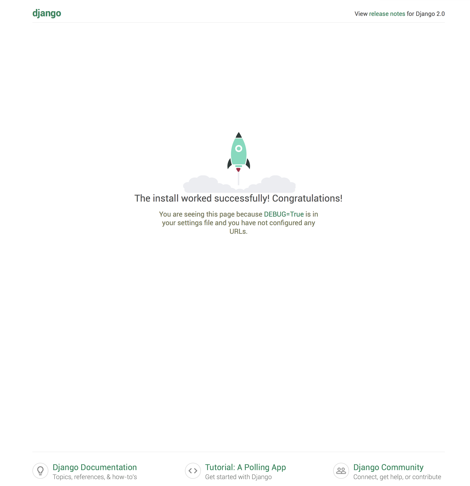

# pd-blog

My blog developed by Python Django

## Preparation

```
$ pip install virtualenv

$ virtualenv virtual
$ cd virtual
$ source bin/activate
$ pip install django
```

## Create the web framework

```
(virtual) ➜  django-admin startproject mblog
(virtual) ➜  cd mblog
(virtual) ➜  python manage.py startapp mainsite

(virtual) ➜  tree .
.
├── mainsite
│   ├── __init__.py
│   ├── admin.py
│   ├── apps.py
│   ├── migrations
│   │   └── __init__.py
│   ├── models.py
│   ├── tests.py
│   └── views.py
├── manage.py
└── mblog
    ├── __init__.py
    ├── __pycache__
    │   ├── __init__.cpython-36.pyc
    │   └── settings.cpython-36.pyc
    ├── settings.py
    ├── urls.py
    └── wsgi.py

4 directories, 14 files
```

## Run the server

```
(virtual) ➜  python manage.py runserver

Performing system checks...

System check identified no issues (0 silenced).

You have 14 unapplied migration(s). Your project may not work properly until you apply the migrations for app(s): admin, auth, contenttypes, sessions.
Run 'python manage.py migrate' to apply them.

December 13, 2017 - 01:33:28
Django version 2.0, using settings 'mblog.settings'
Starting development server at http://127.0.0.1:8000/
Quit the server with CONTROL-C.

```

Now we can access http://127.0.0.1:8000 and we got this:


